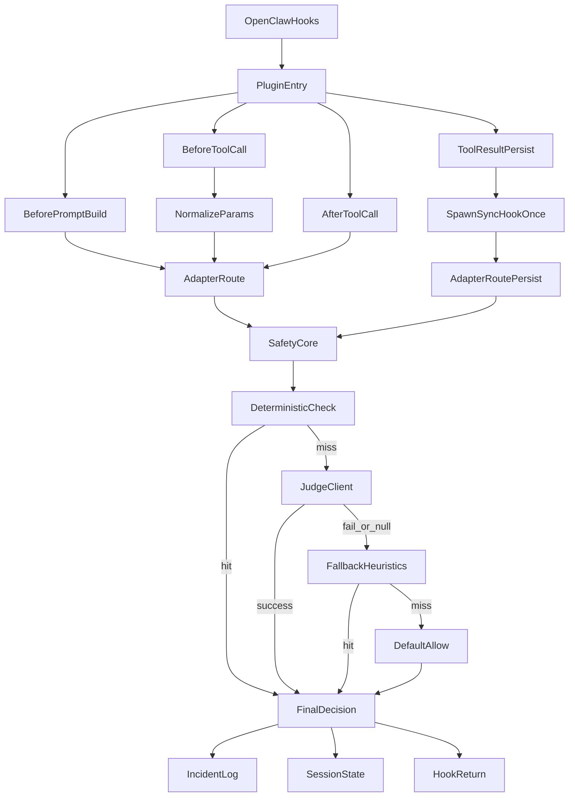
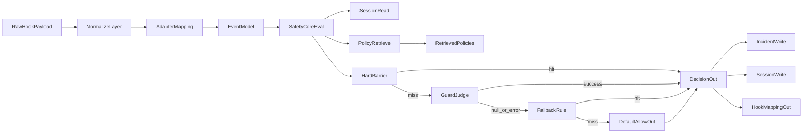

# OpenClaw Safety Plugin: Architecture & Security Guarantees

This document outlines the architecture, execution flows, and security guarantees of the OpenClaw Safety Plugin. It is designed to help developers, architects, and security reviewers understand how payloads are processed, evaluated, and safely persisted.

## How to read this document

1. Start with **TL;DR: Core Philosophy** and **How decisions are made** for vocabulary and outcomes.
2. Read **System architecture and workflows** for hook behavior, step-by-step flow, and the two diagrams.
3. Read **The synchronous bridge and security guarantees** for `tool_result_persist` and `hook-once` boundaries.
4. Use **File guide** when you need to jump straight to implementation.

## TL;DR: Core Philosophy

At its core, this plugin processes every OpenClaw hook through a **staged safety pipeline**. Primary objectives:

1. **Consistency:** Payloads are normalized into a unified internal event model so policy logic runs uniformly across hook types.
2. **Strict evaluation priority:** *Deterministic fences (hard rules) → guard-model judgment (LLM, optional) → fallback heuristics → default allow*.
3. **Observability and continuity:** Final decisions are written to incident logs (auditability) and session state snapshots (short-horizon continuity).

### Key terminology

- **SafetyCore:** Central evaluation orchestrator (`src/core/engine/safety-core.ts`).
- **Deterministic fences:** Hard rules applied before any model-based judgment.
- **Guard model:** Optional online LLM risk judgment (`src/adapters/llm-judge/client.ts`).
- **Sync bridge (`hook-once`):** One-shot subprocess preserving the synchronous `tool_result_persist` contract (`src/entrypoints/scripts/hook-once.ts`).

---

## How decisions are made

When `SafetyCore` evaluates a payload against policy and guard signals, outputs use these semantics:

- `allow`: Continue execution.
- `block`: Deny execution.
- `require_confirm`: Treated as `block` by the gateway path (not a pause-for-human flow in the plugin).
- `sanitize_then_allow`: Merge `sanitized_payload` and continue.

---

## System architecture and workflows

Data enters via OpenClaw lifecycle hooks, is normalized, evaluated by `SafetyCore`, then routed back to the host while state and incidents are persisted.

### Hook-specific workflows

- **`before_tool_call` / `after_tool_call`**
  - *Environment:* Same Node process, `await SafetyCore.evaluate`.
  - *Purpose:* `before_tool_call` can sanitize, replace, require confirm (mapped to block), or block parameters before execution.
- **`before_prompt_build`**
  - *Environment:* Same process when enabled.
  - *Purpose:* Context-risk evaluation and incident logging; does **not** inject prompt instructions.
- **`tool_result_persist` (sync path)**
  - *Environment:* Synchronous hook; parent uses `spawnSync` to run `dist/entrypoints/scripts/hook-once.js`.
  - *Purpose:* JSON request on stdin; JSON decision on stdout. See **The synchronous bridge and security guarantees**.

### Execution flow (step-by-step)

1. **Entry:** `src/entrypoints/plugin/index.ts`
2. **Normalization:** `src/adapters/openclaw/normalize.ts`, `src/adapters/openclaw/tool-params.ts`
3. **Routing:** Internal event in `src/core/models/event.ts`; `SafetyCore` in `src/core/engine/safety-core.ts`
4. **Evaluation:** Policy retrieval, deterministic fences, optional judge, fallback, default allow
5. **Decision and persistence:** Decision model in `src/core/models/decision.ts`; incidents and session state via infrastructure; adapter maps back to hook return shape

### Lifecycle flow diagram

| Diagram node | Primary source |
|----------------|----------------|
| OpenClawHooks | OpenClaw host |
| PluginEntry | `src/entrypoints/plugin/index.ts` |
| NormalizeParams | `src/adapters/openclaw/normalize.ts`, `src/adapters/openclaw/tool-params.ts` |
| AdapterRoute / AdapterRoutePersist | `src/adapters/openclaw/adapter.ts` |
| SpawnSyncHookOnce | `src/entrypoints/scripts/persist-eval.ts` |
| SafetyCore | `src/core/engine/safety-core.ts` |
| DeterministicCheck | `src/core/evaluation/deterministic.ts` |
| JudgeClient | `src/adapters/llm-judge/client.ts` |
| IncidentLog | `src/infrastructure/logger/incidents.ts` |
| SessionState | `src/infrastructure/state/session-state.ts` |

### Data transformation (information flow) diagram

| Diagram node | Primary source |
|----------------|----------------|
| NormalizeLayer | `src/adapters/openclaw/normalize.ts`, `src/adapters/openclaw/tool-params.ts` |
| AdapterMapping | `src/adapters/openclaw/adapter.ts` |
| EventModel | `src/core/models/event.ts` |
| SafetyCoreEval | `src/core/engine/safety-core.ts` |
| SessionRead / SessionWrite | `src/infrastructure/state/session-state.ts` |
| PolicyRetrieve / RetrievedPolicies | `src/core/policy/retriever.ts`, `src/core/policy/loader.ts` |
| HardBarrier | `src/core/evaluation/deterministic.ts` |
| GuardJudge | `src/adapters/llm-judge/client.ts` |
| DecisionOut | `src/core/models/decision.ts` |
| IncidentWrite | `src/infrastructure/logger/incidents.ts` |
| HookMappingOut | `src/adapters/openclaw/adapter.ts` (+ `src/executors/interceptors/tool-result.ts` on persist path) |

---

## The synchronous bridge and security guarantees

`tool_result_persist` must stay synchronous. Evaluation runs in a **child process** (`hook-once`); the parent parses JSON stdout and applies the decision to the message (including optional rewriting) via `src/executors/interceptors/tool-result.ts`.

### `hook-once` security fences

Child execution (`src/entrypoints/scripts/hook-once.ts`, invoked from `src/entrypoints/scripts/persist-eval.ts`):

- **No code execution:** Routing and evaluation only; no executing string code from tool output.
- **JSON-only IPC:** Structured JSON on stdin/stdout.
- **Input validation:** Unknown hooks, invalid shapes, and oversize payloads are rejected.
- **Dynamic API ban:** `eval`, `new Function`, `vm.runInThisContext`, and `vm.Script` are not used on this path.

---

## File guide

Use this as a single index; paths are relative to the repository root.

### By question

- **How does a hook enter the system?** `src/entrypoints/plugin/index.ts`
- **How are external payloads normalized?** `src/adapters/openclaw/normalize.ts`
- **Where is tool param coercion performed?** `src/adapters/openclaw/tool-params.ts`
- **Where is the final decision assembled?** `src/core/engine/safety-core.ts`
- **Where does policy ranking happen?** `src/core/policy/retriever.ts`
- **Where are incidents and session state persisted?** `src/infrastructure/logger/incidents.ts`, `src/infrastructure/state/session-state.ts`

### By common debug scenario

- **Tool call blocked unexpectedly:** `src/core/evaluation/deterministic.ts`, then `src/core/engine/safety-core.ts`, then `src/adapters/openclaw/adapter.ts`.
- **Sanitization not as expected:** `src/adapters/openclaw/tool-params.ts`, `src/core/models/decision-sanitize.ts`
- **`tool_result_persist` inconsistent:** `src/entrypoints/scripts/hook-once.ts`, `src/entrypoints/scripts/persist-eval.ts`, `src/executors/interceptors/tool-result.ts`
- **Policy not loaded or mismatch:** `src/core/policy/loader.ts`, `src/core/policy/retriever.ts`, `src/infrastructure/config/settings.ts`

### By responsibility

**Entry points**

- `src/entrypoints/plugin/index.ts`
- `src/entrypoints/cli/main.ts`
- `src/entrypoints/scripts/hook-once.ts`
- `src/entrypoints/scripts/persist-eval.ts`

**Adapters**

- `src/adapters/openclaw/adapter.ts`
- `src/adapters/openclaw/normalize.ts`
- `src/adapters/openclaw/tool-params.ts`
- `src/adapters/llm-judge/client.ts`

**Core domain**

- `src/core/engine/safety-core.ts`
- `src/core/engine/factory.ts`
- `src/core/evaluation/deterministic.ts`
- `src/core/policy/loader.ts`
- `src/core/policy/retriever.ts`
- `src/core/policy/schema.ts`
- `src/core/models/event.ts`
- `src/core/models/decision.ts`
- `src/core/models/decision-sanitize.ts`

**Executors and interceptors**

- `src/executors/interceptors/tool-result.ts`
- `src/executors/wrappers/shell.ts`
- `src/executors/wrappers/file-write.ts`
- `src/executors/wrappers/web-fetch.ts`

**Infrastructure and shared**

- `src/infrastructure/config/settings.ts`
- `src/infrastructure/logger/incidents.ts`
- `src/infrastructure/state/session-id.ts`
- `src/infrastructure/state/session-state.ts`
- `src/shared/utils/package-root.ts`
- `src/shared/utils/common.ts`

---

## Related documentation

- Operations and configuration: [`USER-GUIDE.md`](./USER-GUIDE.md)
- Documentation hub (this folder): [`docs/README.md`](./README.md)
- Project overview and quick start: [root `README.md`](../README.md)
